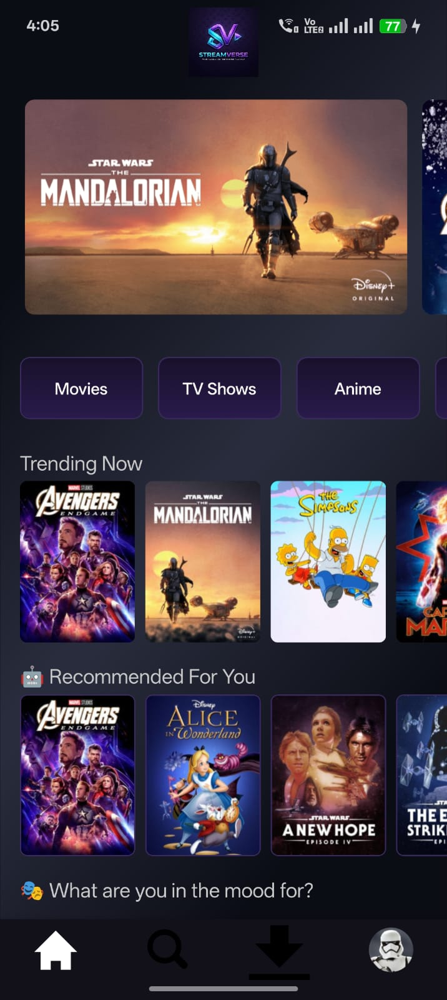
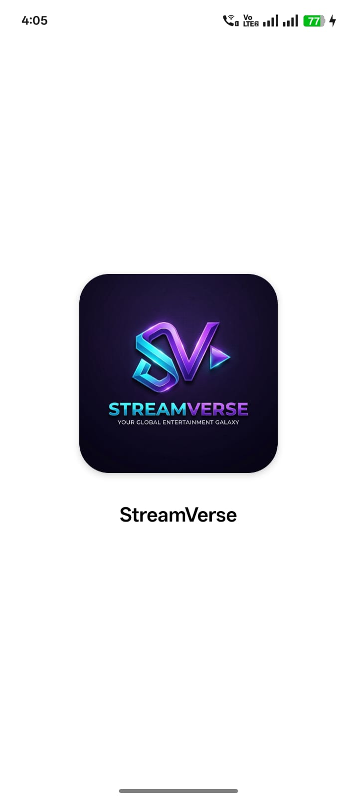
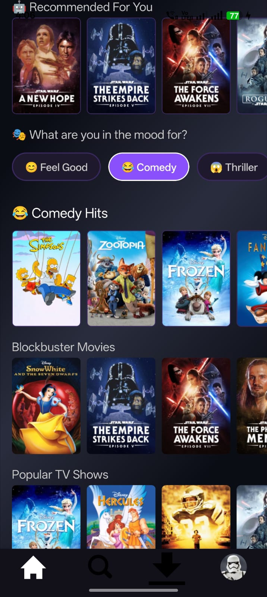
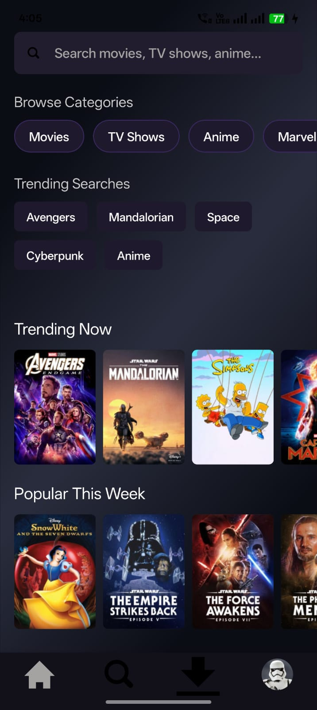
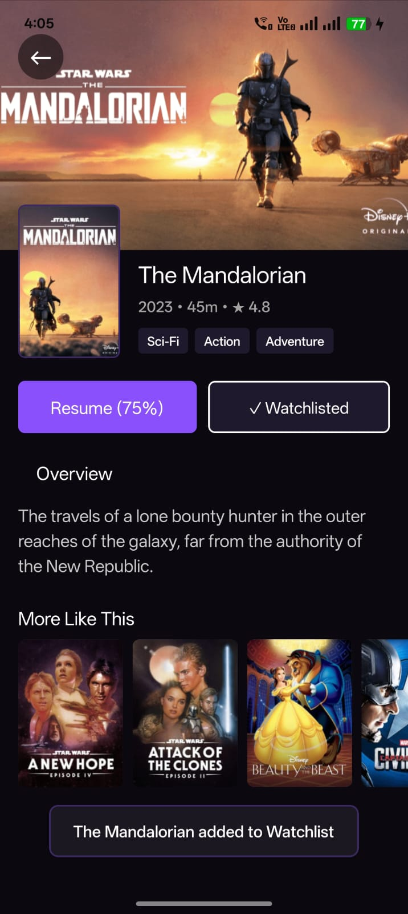
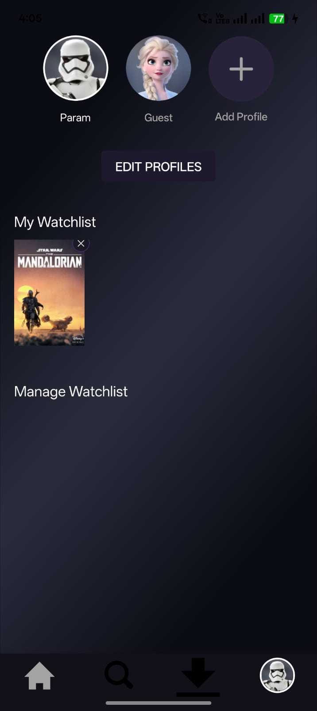
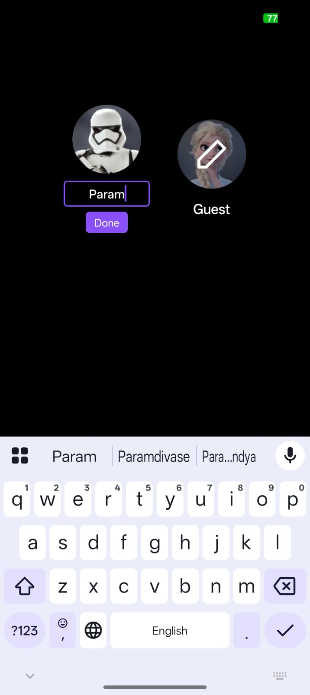
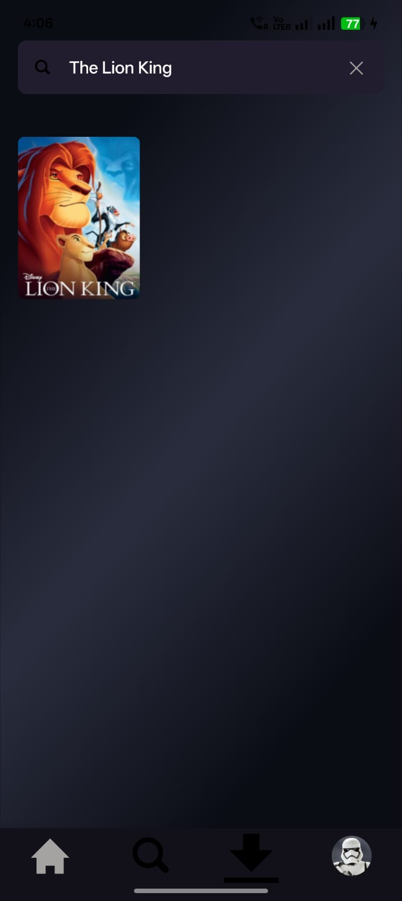
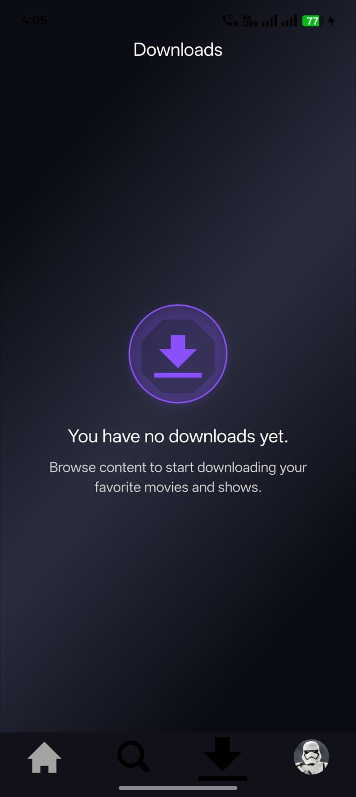

# StreamVerse

<h1 align="center">🎬 StreamVerse</h1>

<p align="center">
  <b>A Modern Streaming Platform built with React Native & Expo SDK 54</b>
</p>

<p align="center">
  
</p>

## ✨ Overview

StreamVerse is a modern OTT streaming platform built with React Native
and Expo SDK 54. It showcases premium UI/UX, AI-inspired
recommendations, mood-based discovery, persistent watchlists, continue
watching, and modular application architecture.

## ✨ Feature Highlights

| Feature | Description |
|---------|-------------|
| 🎬 Premium Home Feed | Dynamic OTT-style homepage featuring trending, featured, and categorized content. |
| 🤖 AI Recommendation Engine | Personalized movie recommendations based on watch history, watchlist, and search activity. |
| 🎭 Mood Discovery | Explore movies by mood including Action, Comedy, Thriller, Sci-Fi, Romance, Fantasy, Feel Good, and Family. |
| 🔍 Smart Search | Debounced search with instant filtering, trending keywords, category filters, and recent searches. |
| ❤️ Watchlist | Save and manage favorite movies with persistent local storage using AsyncStorage. |
| ▶ Continue Watching | Resume previously watched movies with saved playback progress. |
| 👤 Multi-Profile Management | Create, edit, and switch between multiple user profiles. |
| 🎥 Movie Details | Detailed movie information including ratings, genres, runtime, release year, and related content. |
| 🎯 Personalized Discovery | Content dynamically adapts based on user interactions and preferences. |
| 📂 Category Collections | Browse curated movie and TV collections across multiple genres and franchises. |
| 💾 Offline Persistence | Watchlist, profiles, search history, and watch progress remain saved between sessions. |
| ⚡ Smooth User Experience | Skeleton loaders, responsive layouts, smooth scrolling, and subtle animations. |
| 🏗 Modular Architecture | Well-structured component-based architecture designed for scalability and maintainability. |

# 📸 Screenshots

## 📸 Screenshots

<table align="center">

<tr>
<td align="center">
<br>
<b>Splash Screen</b>
</td>

<td align="center">
<br>
<b>Home Screen</b>
</td>

<td align="center">
<br>
<b>Mood Discovery</b>
</td>
</tr>

<tr>
<td align="center">
<br>
<b>Search</b>
</td>

<td align="center">
<br>
<b>Movie Details</b>
</td>

<td align="center">
<br>
<b>Watchlist</b>
</td>
</tr>

<tr>
<td align="center">
<br>
<b>Profile</b>
</td>

<td align="center">
<br>
<b>Search Categories</b>
</td>

<td align="center">
<br>
<b>Downloads</b>
</td>
</tr>

</table>


## 🛠 Tech Stack

  Category    Technology
  ----------- --------------
  Framework   React Native
  Runtime     Expo SDK 54
  Language    JavaScript
  State       Context API
  Storage     AsyncStorage

## 📂 Project Structure

```text
StreamVerse
├── screenshots
├── src
│   ├── components
│   ├── constants
│   ├── context
│   ├── mockdata
│   ├── navigation
│   ├── screens
│   ├── services
│   └── utils
├── App.js
├── app.json
├── babel.config.js
├── CHANGELOG.md
├── CONTRIBUTING.md
├── index.js
├── LICENSE
├── package.json
├── package-lock.json
└── README.md
```

## 🚀 Installation

``` bash
git clone https://github.com/yourusername/StreamVerse.git
cd StreamVerse
npm install
npx expo start
```

## 📜 Disclaimer

This project is intended for educational and portfolio purposes. Movie
titles, posters, logos, and related artwork belong to their respective
owners and are used only as demonstration content.

## Downloads

You can download it from expo.dev: https://expo.dev/accounts/parampandya/projects/streamverse/builds/6a5481ce-a2f9-4931-ae94-862aa90dba61
